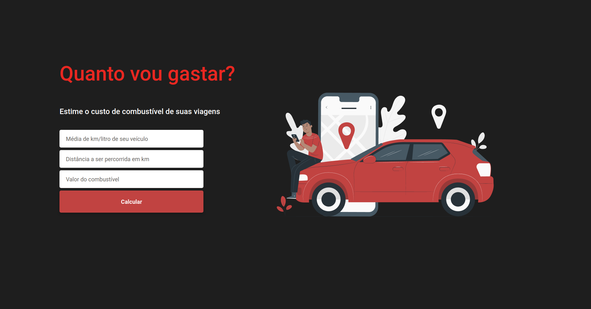

<p align="center">

  

  

  

  

  

</p>
<h1 align="center">
    
</h1>

<h4 align="center">
	🚧  Quanto vou gastar - Em construção 🚀 🚧
</h4>

<p align="center">
 <a href="#-sobre-o-projeto">Sobre</a> •
 <a href="#-funcionalidades">Funcionalidades</a> •
 <a href="#-layout">Layout</a> •
 <a href="#-como-executar-o-projeto">Como executar</a> •
 <a href="#-tecnologias">Tecnologias</a> •
 <a href="#user-content--licença">Licença</a>
</p>


## 💻 Sobre o projeto

🚗 Quanto vou gastar? 💸

Estime o seu gasto de combustível em suas próximas viagens

---

## ⚙️ Funcionalidades

- [x] Landing page
- [x] Componentes
  - [x] Input
  - [x] Button
- [x] Obter objetos do formulário
- [x] Regras de negócios
- [ ] Mensagens de erro
- [ ] Atualização em tela do resultado
- [ ] Adicionar pedágios
- [ ] Incluir API de mapas e calcular as distâncias


---

<!-- ## 🎨 Layout -->

O layout da aplicação está disponível no Figma:

<a href="https://www.figma.com/file/HHKCx9gnGqcxqgV4e7n3ZL/Untitled?node-id=0%3A1](https://www.figma.com/file/HHKCx9gnGqcxqgV4e7n3ZL/Untitled?node-id=0%3A1">
  
</a>

---

## 🚀 Como executar o projeto

### Pré-requisitos

Ambiente React configurado

#### 🎲 Rodando o projeto

```bash

# Clone este repositório
$ git clone https://github.com/rafanp/quanto-vou-gastar

# Instale as dependências
$ yarn

# Execute a aplicação com
$ yarn start

# O servidor inciará na porta:3000 - acesse http://localhost:3000

```
---

## 🛠 Tecnologias

As seguintes ferramentas foram usadas na construção do projeto:

#### **Website**  ([React](https://reactjs.org/)  +  [TypeScript](https://www.typescriptlang.org/))

-   **Unform**
-   **Polished**
-   **Styled components**
-   **Eslint**
-   **Prettier**
-   **[React Icons](https://react-icons.github.io/react-icons/)**

---

## 📝 Licença

Este projeto esta sobe a licença [MIT](./LICENSE).

Feito com ❤️ por Rafael Neves [Entre em contato!](https://www.linkedin.com/in/rafaelnps/)

---
